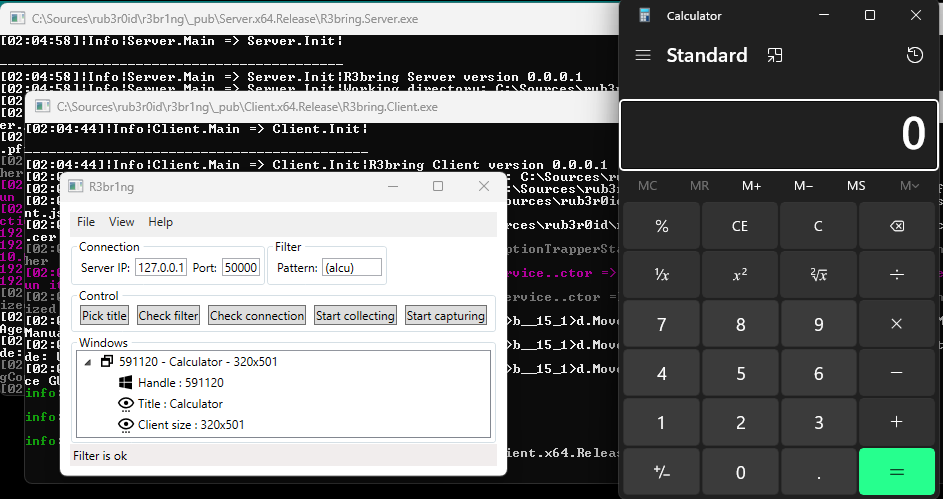

# R3bring

* Last build is [R3bring v0.0.0.1](https://github.com/Lab0ne/Bring/releases/tag/R3bring_0.0.0.1)
* We appreciate you with the helping to [improve that description](https://github.com/Lab0ne/Bring/issues) or to [give the feedback](https://www.maxinmontreal.com/forums) about R3bring.

# FAQ

## WTF is it and how I can use it?
### Idea 
You run the R3bring.Client on the main machine to manage all the nessesary windows by connecting it to the R3bring.Server for the remote control.

<br>

### Installation
* [Install all .NET Runtimes](https://dotnet.microsoft.com/en-us/download/dotnet/8.0)
* Unpack R3bring zip to somewhere

### Starting to use
* Run R3bring.Client.exe
* Press Help->Introduction Tour and follow the tips

### Investigate it
* Check Configs folders, read descriptions into client.json and server.json to understand it better
* Read this FAQ till the end

## I need to catch many windows for the OH. Do I need to run many Servers and many Clients for that?
No. R3bring.Client will capture all windows automatically (existed or a new one) by its extended titles (format is 'handle - title - size'). 

Captured windows will be transferred to the R3bring.Server according to connection properties. 

R3bring.Client pulls all mouse\keyboard events back from the R3bring.Server to operate remotely with any captured window.

## Is it secure?
It's depend on you. It looks like a browser (web client) makes a HTTP(s) session to somewhere (web server) with some packed traffic inside. 

HTTPs session between R3bring.Client and R3bring.Server can be established after some additional steps
1. Open R3bring.Client
    * press File->Generate certificates
    * select Configs folder of the R3bring.Server to save server.pfx (it also save automatically client.cer file at R3bring.Client Configs folder)
2. Set "connectionMode" to "Secure" inside server.json and client.json

## I have a hopper. Is it possible to interact with the Client and ask it to capture only necessary windows by handles?
Short answer is Yes. But you have to put these handles into the client.json config when you need to add or update it.

Set "FilterPattern" value by your hopper in the format: "(handle1)|(handle2)|..." 

R3bring.Client will automatically reload the config to use the new one windows filter pattern.

## I have the Super mouse button pressing code, can I use it with the Client?
Yes, you can. Implement header functions below then compile your C++ code to Operator.dll and put it into Dll folder (just replace the original one). 

It has to be x64 dynamic link library. R3bring.Client on mouse event from R3bring.Server will call activate_window and then one of the mouse_click function, same behavior for the keyboard event.

```cpp
#define API __declspec(dllexport)
extern "C"
{
	enum mouse_button { mouse_left, mouse_middle, mouse_right };

	API void mouse_click(const HWND handle, const RECT rect, const mouse_button button, const int clicks);
	API void mouse_click_drag(const HWND handle, const RECT rect);
	API void activate_window(const HWND handle);
	API void send_key(const byte key);
}
```

## I need to use Old Windows for OH in my Virtual Machine. What Windows version do you support here?
* Server: Windows 7.0 x64 (last SP updated) or higher
* Client: Windows 10 x64 (21H1) or higher
* Don't forget to install .net8.0 runtime (latest available version)
  1. dotnet-runtime-8.X.X-win-x64.exe
  2. aspnetcore-runtime-8.X.X-win-x64.exe
  3. windowsdesktop-runtime-8.X.X-win-x64.exe

## I have OH on the separate machine. How to connect R3bring.Client to R3bring.Server?
Run R3bring.Server, check its log (on Console window or inside of Logs folder) - it has IP addresses of your network adapters. 

Select one appropriate IP, set "host" value to it into server.json as well as you set it into client.json (or from R3bring.Client GUI).

If you want to test it locally - use 127.0.0.1 IP address for the Client and Server.

Client and Server has to be used by the same port value.

## I hate the GUI, can Client be just a service or daemon process?
Yes. Set "R3BringClientMode" value inside client.json to "Agent" mode - at start it will load config and start capturing according its parameters.

You can also try to run R3Bring.Client from windows taskscheduler.

## I love GUI, does server has it?
No plans to create it.

## I love GUI, cause idk how to properly exit from the Console! What I can to do?
Press Ctrl+C in Console or just close Console window.

R3bring.Client GUI File->Close menu button just close the GUI, to exit you have to press File->Exit.

## Can I use many R3Bring.Clients with one R3Bring.Server?
No. And we can't imagine scenario why you need it now. 

But if you want, you can run different pairs of server and client to use different port by each pair.

## I try to create the best filter for the different windows. How do I create powerful pattern for all of this?
You can start from [.NET regex help](https://learn.microsoft.com/en-us/dotnet/standard/base-types/regular-expressions).

Use online regex helpers to test your filter pattern. Press Start collecting in R3bring.Client to check how your pattern is work at live.

## Does it consume all of my resources to capture all windows?
It uses your GPU for capturing.

It uses your RAM to keep bitmaps. (more captured windows - more consumed memory)

It uses your CPU to optimize and pack the data to transfer by network from Client to Server.

We don't expect too much resource consumption (depends on your machine config) and suppose it can be ~5-7%.

## I want to run it with antoher working directory or with another Configs/client1.json config or with another Configs/client.cer certificate for the Client or maybe for the Server too. How can I do that?
Run R3Bring.Client or R3Bring.Server with --help argument, check the log or see Console information about -r -c -s arguments. 

You can set at running custom root (aka working) directory, custom filename of the Configs/foo.json config at the root directory or Configs/bar.cer certificate here.